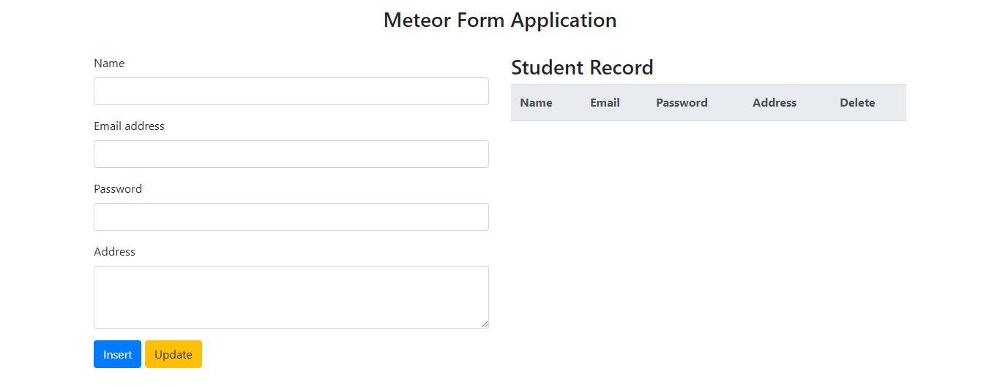
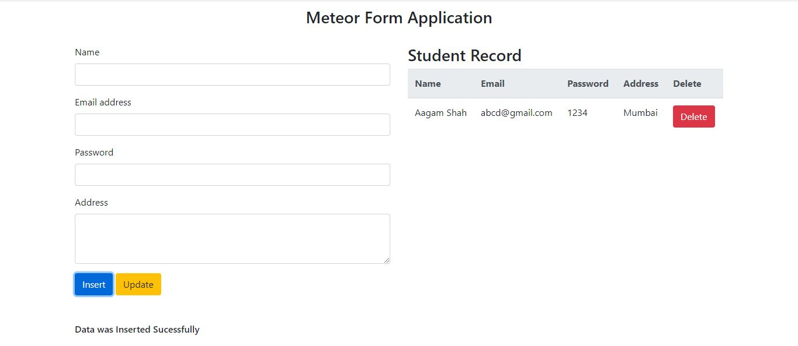

# Meteor Framework CRUD Operations

Meteor is an ultra-simple environment for building modern web applications.This Application has all the following features

  - CRUD Operation with MongoDb
  - UI Desigin using Bootstrap 4.0

## Quick Start

Given below are the steps needed to run the following meteor project 

- Installing MeteorJs
		On Windows, the installer can be found at https://www.meteor.com/install.
		On Linux/macOS, use this line: curl https://install.meteor.com/ | sh

- Pull the repository using the command in gitbash
		 git pull "https://github.com/Aagam1090/MetoerJS-CRUD-Operations.git"

- Running the Application
		 cd ../filepath/App
		meteor

The Application by default runs on localhost:3000 

## Screenshot
- Basic Form UI

